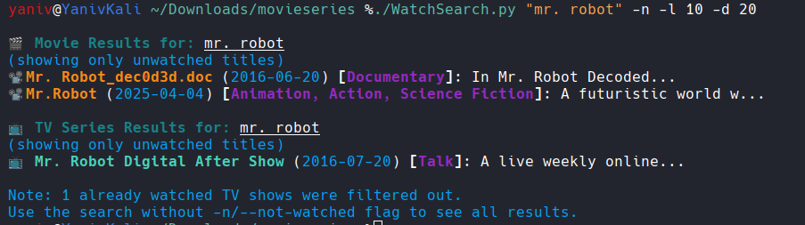
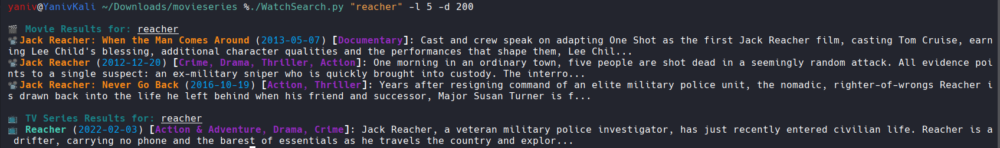
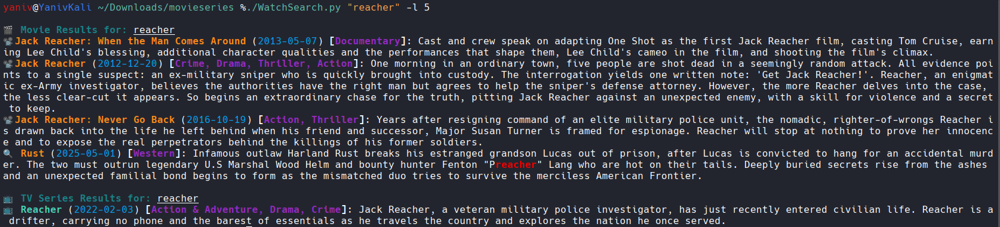

# WatchWise

A set of CLI tools to search for movies and TV shows with optional filtering based on your watch history. Integrates with TMDb for media information and Trakt.tv for watch history tracking.

## Features

- 🔍 **Search Movies and TV Shows**: Find content by title or keywords
- 📺 **Detailed Information**: View release dates, genres, and descriptions
- 🎬 **Filter by Type**: Search for movies only or TV shows only
- ⌛ **Filter by Year**: Find content from a specific release year
- ✅ **Watch History Integration**: Filter out content you've already watched
- 🔎 **Description Search**: Find media that matches keywords in descriptions
- 🎭 **Genre Highlighting**: Visual display of genres for better categorization

## Installation

### Prerequisites

- Python 3.6+
- [TMDb API Key](https://www.themoviedb.org/settings/api)
- [Trakt.tv API Access](https://trakt.tv/oauth/applications) (optional, for watch history)

### Setup

1. Clone the repository:

   ```bash
   git clone https://github.com/YanivHaliwa/WatchWise.git
   cd WatchWise
   ```
2. Install dependencies:

   ```bash
   pip install -r requirements.txt
   ```
3. Set up your TMDb API Key:

   ```bash
   export TMDB_API_KEY="your_tmdb_api_key"   
   ```
4. (Optional) Set up Trakt.tv integration:

   ```bash
   export TRAKT_CLIENT_ID="your_trakt_client_id"
   export TRAKT_CLIENT_SECRET="your_trakt_client_secret"
   ./getTrakt.sh
   ```

   Outputs:

   ```bash
   TRAKT_ACCESS_TOKEN="xyz"   
   TRAKT_REFRESH_TOKEN="xyz"   
   ```

   set up your TRAKT TOKEN:

   ```bash
   export TRAKT_ACCESS_TOKEN="your_trakt_access_token"
   ```

   Follow the instructions to authorize the application and set the required environment variables.

## Usage

### Search for Movies and TV Shows

Basic search for both movies and TV shows:

```bash
python WatchSearch.py "The Matrix"
```

Search for movies only:

```bash
python WatchSearch.py -m "The Matrix"
```

Search for TV shows only:

```bash
python WatchSearch.py -s "Breaking Bad"
```

Filter by year:

```bash
python WatchSearch.py -y 2022 "Top Gun"
```

Filter out already watched content:

```bash
python WatchSearch.py -n "Marvel"
```

Limit number of results:

```bash
python WatchSearch.py -l 5 "Star Wars"
```

Control description length:

```bash
python WatchSearch.py -d 200 "Inception"  # Show 200 characters
python WatchSearch.py -d 0 "Inception"    # Show full descriptions
```

Enable debug output:

```bash
python WatchSearch.py --debug "Matrix"
```

screenshots:





### Check Watch History

Show all watched movies and TV shows:

```bash
python watched.py -a
```

Check if a specific title has been watched:

```bash
python watched.py -q "Breaking Bad"
```

## API Keys and Configuration

The application uses environment variables for configuration:

### Required Environment Variables

- `TMDB_API_KEY`: Your TMDb API key (required for movie/show search)
- `TRAKT_CLIENT_ID`: Your Trakt.tv client ID (required for watch history)
- `TRAKT_CLIENT_SECRET`: Your Trakt.tv client secret (required for token generation)
- `TRAKT_ACCESS_TOKEN`: Your Trakt.tv access token (required for watch history)

### Optional Environment Variables

- `TRAKT_REFRESH_TOKEN`: Generated when running getTrakt.sh (for future token refresh)

### Obtaining API Keys

#### TMDb API Key

1. Create an account on [TMDb](https://www.themoviedb.org/)
2. Go to your account settings
3. Select the API section
4. Request an API key for developer use

#### Trakt.tv API Access

1. Create an account on [Trakt.tv](https://trakt.tv)
2. Go to [Settings &gt; Your API Applications](https://trakt.tv/oauth/applications)
3. Create a new application to get your Client ID and Client Secret
4. Run `./getTrakt.sh` and follow the instructions to generate your access token

## Contributing

Contributions are welcome! Please feel free to submit a Pull Request.

## Author

Created by [Yaniv Haliwa](https://github.com/YanivHaliwa) for educational purposes.

## License

This project is licensed under the MIT License - see the LICENSE file for details.
