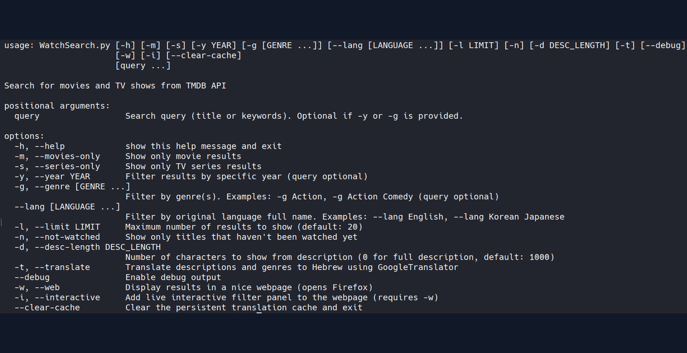

# WatchWise

[![zread](https://img.shields.io/badge/Ask_Zread-_.svg?style=flat&color=00b0aa&labelColor=000000&logo=data%3Aimage%2Fsvg%2Bxml%3Bbase64%2CPHN2ZyB3aWR0aD0iMTYiIGhlaWdodD0iMTYiIHZpZXdCb3g9IjAgMCAxNiAxNiIgZmlsbD0ibm9uZSIgeG1sbnM9Imh0dHA6Ly93d3cudzMub3JnLzIwMDAvc3ZnIj4KPHBhdGggZD0iTTQuOTYxNTYgMS42MDAxSDIuMjQxNTZDMS44ODgxIDEuNjAwMSAxLjYwMTU2IDEuODg2NjQgMS42MDE1NiAyLjI0MDFWNC45NjAxQzEuNjAxNTYgNS4zMTM1NiAxLjg4ODEgNS42MDAxIDIuMjQxNTYgNS42MDAxSDQuOTYxNTZDNS4zMTUwMiA1LjYwMDEgNS42MDE1NiA1LjMxMzU2IDUuNjAxNTYgNC45NjAxVjIuMjQwMUM1LjYwMTU2IDEuODg2NjQgNS4zMTUwMiAxLjYwMDEgNC45NjE1NiAxLjYwMDFaIiBmaWxsPSIjZmZmIi8%2BCjxwYXRoIGQ9Ik00Ljk2MTU2IDEwLjM5OTlIMi4yNDE1NkMxLjg4ODEgMTAuMzk5OSAxLjYwMTU2IDEwLjY4NjQgMS42MDE1NiAxMS4wMzk5VjEzLjc1OTlDMS42MDE1NiAxNC4xMTM0IDEuODg4MSAxNC4zOTk5IDIuMjQxNTYgMTQuMzk5OUg0Ljk2MTU2QzUuMzE1MDIgMTQuMzk5OSA1LjYwMTU2IDE0LjExMzQgNS42MDE1NiAxMy43NTk5VjExLjAzOTlDNS42MDE1NiAxMC42ODY0IDUuMzE1MDIgMTAuMzk5OSA0Ljk2MTU2IDEwLjM5OTlaIiBmaWxsPSIjZmZmIi8%2BCjxwYXRoIGQ9Ik0xMy43NTg0IDEuNjAwMUgxMS4wMzg0QzEwLjY4NSAxLjYwMDEgMTAuMzk4NCAxLjg4NjY0IDEwLjM5ODQgMi4yNDAxVjQuOTYwMUMxMC4zOTg0IDUuMzEzNTYgMTAuNjg1IDUuNjAwMSAxMS4wMzg0IDUuNjAwMUgxMy43NTg0QzE0LjExMTkgNS42MDAxIDE0LjM5ODQgNS4zMTM1NiAxNC4zOTg0IDQuOTYwMVYyLjI0MDFDMTQuMzk4NCAxLjg4NjY0IDE0LjExMTkgMS42MDAxIDEzLjc1ODQgMS42MDAxWiIgZmlsbD0iI2ZmZiIvPgo8cGF0aCBkPSJNNCAxMkwxMiA0TDQgMTJaIiBmaWxsPSIjZmZmIi8%2BCjxwYXRoIGQ9Ik00IDEyTDEyIDQiIHN0cm9rZT0iI2ZmZiIgc3Ryb2tlLXdpZHRoPSIxLjUiIHN0cm9rZS1saW5lY2FwPSJyb3VuZCIvPgo8L3N2Zz4K&logoColor=ffffff)](https://zread.ai/YanivHaliwa/WatchWise)
[](https://deepwiki.com/YanivHaliwa/WatchWise)

A set of CLI tools to search for movies and TV shows with optional filtering based on your watch history. Integrates with TMDb for media information and Trakt.tv for watch history tracking.

## Features

- 🔍 **Search Movies and TV Shows**: Find content by title or keywords
- 📺 **Detailed Information**: View release dates, genres, and descriptions
- 🎬 **Filter by Type**: Search for movies only or TV shows only
- ⌛ **Filter by Year**: Find content from a specific release year
- 🎭 **Filter by Genre**: Browse or search by one or multiple genres (query optional)
- 🌍 **Filter by Language**: Show only content in specific original languages
- ✅ **Watch History Integration**: Filter out content you've already watched
- 🔎 **Description Search**: Find media that matches keywords in descriptions
- 🏷️ **Genre & Language Badges**: Visual display of genres and original language for each result
- 🌐 **Hebrew Translation**: Translate titles, descriptions, and genres to Hebrew via `deep_translator` (GoogleTranslator) with persistent disk cache — already-translated strings are served instantly without any network call
- ⚡ **Smart Caching**: Persistent translation cache on disk + in-memory TMDB search cache per session to avoid redundant API calls
- 🖥️ **Web View**: Display results as a styled dark-theme HTML page opened in Firefox
- ⚡ **Interactive Mode**: Full in-browser SPA with live filters for type, year, genre, language, and watched status (requires web mode)
- 📊 **Relevance Scoring**: Results ranked by how closely they match your query
- 🔜 **Coming Soon Badges**: Upcoming releases are automatically labeled in web view


## Screenshots




## Installation

### Prerequisites

- Python 3.6+
- [TMDb API Key](https://www.themoviedb.org/settings/api)
- [Trakt.tv API Access](https://trakt.tv/oauth/applications) (optional, for watch history)
- `jq` (required for `getTrakt.sh`): `apt install jq`

### Setup

1. Clone the repository:

   ```bash
   git clone https://github.com/YanivHaliwa/WatchWise.git
   cd WatchWise
   ```
2. Install dependencies:

   ```bash
   pip install -r requirements.txt
   ```
3. Set up your TMDb API Key:

   ```bash
   export TMDB_API_KEY="your_tmdb_api_key"
   ```
4. (Optional) Set up Trakt.tv integration:

   ```bash
   export TRAKT_CLIENT_ID="your_trakt_client_id"
   export TRAKT_CLIENT_SECRET="your_trakt_client_secret"
   ./getTrakt.sh
   ```

   The script will prompt you to authorize the app, then **automatically save the tokens to `~/.zshrc`** and export them to the current shell. No manual export needed.

## Usage

### Search for Movies and TV Shows

Basic search for both movies and TV shows:

```bash
python WatchSearch.py "The Matrix"
```

Search for movies only:

```bash
python WatchSearch.py -m "The Matrix"
```

Search for TV shows only:

```bash
python WatchSearch.py -s "Breaking Bad"
```

Filter by year:

```bash
python WatchSearch.py -y 2022 "Top Gun"
```

Filter by genre (query is optional — browse without a search term):

```bash
python WatchSearch.py -g Action "Marvel"
python WatchSearch.py -g Action Comedy -y 2023   # browse by genre + year, no query needed
```

Filter by original language:

```bash
python WatchSearch.py --lang Korean
python WatchSearch.py --lang Korean Japanese "thriller"
```

Filter out already watched content:

```bash
python WatchSearch.py -n "Marvel"
```

Limit number of results:

```bash
python WatchSearch.py -l 5 "Star Wars"
```

Control description length:

```bash
python WatchSearch.py -d 200 "Inception"  # Show 200 characters
python WatchSearch.py -d 0 "Inception"    # Show full descriptions
```

Translate results to Hebrew:

```bash
python WatchSearch.py -t "Inception"
```

Open results in a styled web page:

```bash
python WatchSearch.py -w "Inception"
```

Open interactive browser UI (live filters, no page reload):

```bash
python WatchSearch.py -w -i "Inception"
python WatchSearch.py -w -i              # launch blank interactive mode
```

Clear the persistent translation cache:

```bash
python WatchSearch.py --clear-cache
```

Enable debug output:

```bash
python WatchSearch.py --debug "Matrix"
```

### Check Watch History

Show all watched movies and TV shows:

```bash
python watched.py -a
```

Check if a specific title has been watched:

```bash
python watched.py -q "Breaking Bad"
```

Enable debug output:

```bash
python watched.py -d
```

## API Keys and Configuration

The application uses environment variables for configuration:

### Required Environment Variables

- `TMDB_API_KEY`: Your TMDb API key (required for movie/show search)

### Optional Environment Variables

- `TRAKT_CLIENT_ID`: Your Trakt.tv client ID (required for watch history)
- `TRAKT_CLIENT_SECRET`: Your Trakt.tv client secret (required for token generation)
- `TRAKT_ACCESS_TOKEN`: Your Trakt.tv access token (auto-saved by `getTrakt.sh`)
- `TRAKT_REFRESH_TOKEN`: Generated by `getTrakt.sh` (for future token refresh)

### Obtaining API Keys

#### TMDb API Key

1. Create an account on [TMDb](https://www.themoviedb.org/)
2. Go to your account settings
3. Select the API section
4. Request an API key for developer use

#### Trakt.tv API Access

1. Create an account on [Trakt.tv](https://trakt.tv)
2. Go to [Settings > Your API Applications](https://trakt.tv/oauth/applications)
3. Create a new application to get your Client ID and Client Secret
4. Set `TRAKT_CLIENT_ID` and `TRAKT_CLIENT_SECRET`, then run `./getTrakt.sh`
5. The script handles the full device-code OAuth flow and saves tokens to `~/.zshrc` automatically

## Caching

WatchWise uses two cache layers to keep things fast:

### Translation Cache (Persistent)

Translations are stored in `.trans_cache.json` in the project directory.

- Loaded automatically at startup
- Auto-saved to disk on exit and after every batch translate
- Parallel batch translation via `deep_translator` (`GoogleTranslator`) — up to 10 concurrent threads
- Already-cached strings are served instantly with zero network calls
- Cache survives across sessions — you never re-translate the same text twice

Clear the cache when needed:

```bash
python WatchSearch.py --clear-cache
```

### Watched Titles Cache (Persistent)

Your Trakt.tv watch history is saved to `.watched_cache.json` in the project directory.

- First run with `-n`: fetches from Trakt API (~25s), saves to disk
- Subsequent runs: loads from disk instantly (near 0s)
- Cache auto-refreshes after **24 hours**
- Force a refresh manually:

```bash
python watched.py -r
```

### TMDB Search Cache (In-Memory)

TMDB search results are cached in memory for the duration of the session.

- Keyed by query, year, genre, limit, and description length
- Repeat searches with the same parameters hit the cache instantly instead of re-querying TMDB
- Especially useful in interactive mode (`-w -i`) where you may search the same term multiple times

## Contributing

Contributions are welcome! Please feel free to submit a Pull Request.

## Author

Created by [Yaniv Haliwa](https://github.com/YanivHaliwa) for educational purposes.

## License

This project is licensed under the MIT License - see the LICENSE file for details.
